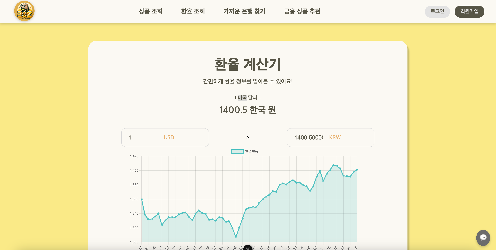
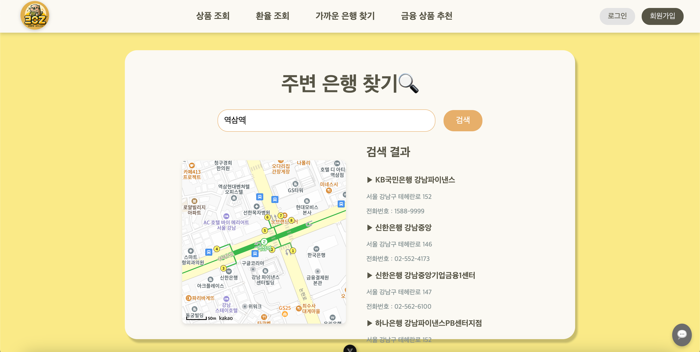
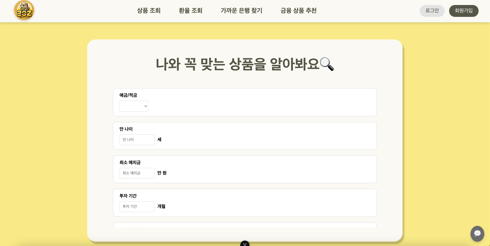

# ✨두더Z Plan (Do The Z Plan) ✨
두더지처럼 깊이 파고 들어 Z세대를 위한 금융 정보를 제공하고 미래 계획을 도와주는 애플리케이션
## 💡 프로젝트 개요
- **Project Name**: 두더Z Plan (Do The Z Plan)
- **🛠 기술 스택**: 
  - 백엔드:  

  - 프론트엔드: 


  - 데이터베이스: 

  - 기타: 

 Financial Products API, Kakao Map API, Exchange Rate API


- **주요 기능**: 
  - 금융 상품 정보 조회 및 리뷰
  - 환율 계산기 및 환율 추이 차트
  - 근처 은행 검색
  - 사용자 맞춤형 설문 기반 상품 추천
  - 군집화 알고리즘을 통한 사용자 맞춤 상품 추천


## 👥 팀원 정보 및 업무 분담 내역
### ⚙️ **Frontend**

| **Team FE**  | 신예주  | 이아영  | 이연규 👑 |
|:-------------:|:-------:|:-------:|:-------:|
| **Profile**   |  | |  |
| **GitHub ID** | [@yejushin2000](https://github.com/yejushin2000) |[@aaaange](https://github.com/aaaange) | [@Da-413](https://github.com/Da-413) |
| **Role**      |     인근 은행 조회(MAP), 프로필, 설문조사, 금융 상품 추천    | 회원가입, 로그인, 로그아웃, 회원탈퇴, 금융 상품 리뷰, 환율 계산기 | 메인페이지, 금융 상품 조회 및 상세 조회    |

---

### ⚙️ **Backend**

| **Team FE**  | 신예주  | 이아영  | 이연규 👑 |
|:-------------:|:-------:|:-------:|:-------:|
| **Profile**   |  | |  |
| **GitHub ID** | [@yejushin2000](https://github.com/yejushin2000) |[@aaaange](https://github.com/aaaange) | [@Da-413](https://github.com/Da-413) |
| **Role**      |     MAP API를 통한 인근 은행 DB, 상품 리뷰 기능, 환율 API DB    | 회원가입, 로그인, 로그아웃, 회원탈퇴, 예적금 API DB  | 메인페이지, 회원 프로필, 회원별 가입 금융 상품 및 금리 그래프, 설문조사 기능 및 DB, 군집화 비지도 학습 추천 시스템, 생성형 AI 챗봇 서비스 구현 |


## 🔧 설계 내용 및 실제 구현 정도
### 💻 Feature
| **기능**                     | **세부 설명**                                                                                     | 실제 구현 정도 |
|------------------------------|-------------------------------------------------------------------------------------------------|------|
| **메인 페이지**              | 인증 상태에 따라 회원가입, 로그인, 프로필 페이지 등으로 이동 가능하며 금융 관련 기능으로의 네비게이션 제공 | ✅ |
| **회원가입**                 | 아이디, 비밀번호 조건 검증 및 회원가입 후 자동 로그인 처리                                        |✅ |
| **로그인/로그아웃**          | 아이디 비밀번호로 로그인 및 로그아웃 처리                                         |✅ |
| **회원탈퇴**                 | 계정 및 관련 데이터 삭제                                                                          |✅ |
| **프로필 관리**              | 사용자 정보 조회 및 회원 정보 수정 가능                                                   |✅ |
| **가입 금융상품 조회**       | 사용자가 가입한 금융상품 목록과 관련 정보 조회 및 금리 정보 시각화                                                   |✅ |
| **금리 그래프 조회**         | 금융상품 금리 변동 그래프 시각화                                                                 |✅ |
| **댓글 관리**                | 예적금 상품에 대한 리뷰 작성, 조회, 수정, 삭제 기능 제공                                          |✅ |
| **예적금 데이터 저장**       | 금융상품 API 데이터를 필터링하여 DB에 저장                                                      |✅ |
| **예적금 조회 및 가입**      | 예적금 목록 조회, 필터링, 상세 정보 출력, 가입하기 기능 제공                                      |✅ |
| **환율 계산기**              | 실시간 환율 데이터를 바탕으로 금액 변환 및 환율 추이 차트 제공                                        |✅ |
| **은행 검색**                | 카카오맵 API를 사용하여 근처 은행 정보 검색 및 출력                                              |✅ |
| **설문조사 및 상품 추천**    | 설문 응답 기반 금융상품 추천과 군집화 알고리즘을 통한 사용자 그룹 분석                           |✅ |


## 🔑 ERD


## **📌 금융 상품 추천 알고리즘**
### **1) 설문조사 응답 기반 필터링**
- **필터링 규칙 정의**:
  - 설문조사에서 사용자가 입력한 정보를 바탕으로 금융 상품을 필터링합니다.
  - 사용자가 선호하는 조건(금리, 기간, 최소 예치금액 등)을 기반으로 금융 상품 데이터베이스를 조회합니다.
  - 예) 
    - 금리 선호도: 3% 이상 → 금리가 3% 이상인 상품만 조회
    - 기간 선호도: 12개월 → 가입 기간이 12개월과 일치하는 상품 필터링
    - 예치금액: 100만 원 → 최소 예치금액이 100만 원 이하인 상품만 포함
### **2) 군집화 알고리즘 구현**
- **목적**: 
  - 설문조사 데이터를 기반으로 고객의 금융 상품 선택 패턴을 학습.
  - 유사한 고객 군집을 생성하여 군집별로 가장 선호하는 상품을 추천.
- **데이터 준비**:
  - **더미 데이터 생성**:
    - 가상 고객 데이터를 생성하여 알고리즘 학습 및 테스트에 활용.
    - 데이터 예시:
      - 고객 ID: `user_01`
      - 설문 응답: 금리 선호도(3%), 가입 기간(12개월), 최소 예치금(100만 원)
      - 추천된 금융 상품: `상품 A`, `상품 B`, `상품 C`
      - 고객 최종 선택: `상품 A` (랜덤 선택)
    - 데이터 형식:
      ```python
      dummy_data = [
          {'user_id': 'user_01', 'interest_rate': 3, 'duration': 12, 'min_deposit': 100, 'chosen_product': 'A'},
          {'user_id': 'user_02', 'interest_rate': 2.5, 'duration': 24, 'min_deposit': 50, 'chosen_product': 'B'},
          ...
      ]
      ```
- **군집화 알고리즘**:
  - 설문조사 응답 데이터를 기반으로 사용자를 군집화.
  - 군집화 알고리즘(비지도학습)으로 유사한 사용자를 그룹화한 뒤 각 그룹에 적합한 금융 상품 추천.

## **⭐️ 서비스 대표 기능**
### 1) **금융 상품 정보 조회**
- 금융 상품(예금, 적금)의 금리 및 세부 조건 조회.
- 상품별 리뷰 작성 및 수정/삭제 기능 제공.

### 2) **환율 계산기**
- 실시간 환율 정보 제공.
- 사용자 입력 금액을 다른 통화로 변환 후 출력.
- 최근 3개월 환율 차트 제공.

### 3) **근처 은행 찾기**
- 사용자의 검색 위치를 기반으로 가까운 은행 검색.
- 은행 위치, 이름, 연락처 등의 정보를 표시.

### 4) **맞춤형 금융 상품 추천**
- 설문조사를 기반으로 사용자에 맞는 금융 상품 추천.
- 군집화 알고리즘을 통한 금융 상품 추천

### 5) **생성형 AI 기반 챗봇**
- 생성형 AI를 사용한 챗봇 기능 구현.

## **🫧 생성형 AI 활용**
- 설문 조사 질문 생성 및 UI 개선 아이디어 도출.
- 금융 상품 추천 로직 설계 과정에서 AI를 활용해 최적화된 알고리즘 도출.
- 생성형 AI를 통한 챗봇 기능 구현


## 📆 Calendar
| 일시 | 내용 |
|:-------------:|:-------:|
| 2024-11-18  | 기획, 구현 기능 및 일정 정리, 사용자 요구사항 명세서, 역할 분배, 프론트 초안 작성 |
| 2024-11-19 | 프론트 UI/UX 구성, ERD, 메인 페이지, USER(회원가입, 로그인, 로그아웃) 기능 구현, 인근 은행 서치 기능 구현 1차, 피그마로 초안(프로필 페이지, 추천 알고리즘) 완성 |
| 2024-11-20 |  USER(회원가입, 로그인) UI 및 연동, 프로필 기능 구현, 설문조사 모델 구현, 프로필 페이지 UI |
| 2024-11-21 | 예적금 API DB, 예적금 전체 및 상세 조회 UI, 프로필 페이지 UI 및 기능 연동, MAP 수정  |
| 2024-11-22 | 상품 리뷰 UI, 회원 탈퇴 UI, 로그아웃 및 회원 탈퇴 기능 연동, 인증 토큰 수정, 예적금 전체 및 상세 조회 기능 연동, 설문조사 UI, |
|2024-11-23 | 환율 계산기 UI, 회원별 가입 상품 UI 및 기능 구현, 상품 추천 페이지 UI |
|2024-11-24 | 군집화 알고리즘, 필터링 추천 알고리즘 구현, 환율 예측 DB, 상품 리뷰 연동 |
|2024-11-25| 설문조사 DB 연동, 환율 계산기 DB 연동, 사용자 가입 상품 상세페이지 연동, 사용자 별 리뷰 수 업데이트, 지도 UI 업데이트, 필터링 알고리즘 연동, 전반적 CSS 디테일 수정 |
|2024-11-26| 군집화 알고리즘 연동, 리뷰 UI 업데이트, 환율 그래프 UI 업데이트, 프로필 금리 그래프 UI 업데이트, 전반적 CSS 통일, 회원정보 수정 UI, 생성형 AI 챗봇 서비스 구현, 프로젝트 발표 준비 |


## 📷 스크린샷 (Screenshots)
1. **메인페이지**:
    

2. **회원가입 화면**: 사용자가 아이디와 비밀번호를 입력하여 계정을 생성합니다.
   

3. **로그인 화면**: 사용자가 아이디와 비밀번호를 입력하여 로그인합니다.
   

4. **상품 조회**: 사용자가 원하는 정보로 필터링하여 직접 금융 상품을 조회합니다.
   

5. **환율 계산기**: 사용자가 아이디와 비밀번호를 입력하여 로그인합니다.
   

2. **가까운 은행 찾기**: 사용자가 검색한 위치 기반 가까운 은행 정보를 제공합니다.
   

2. **금융상품 추천**: 사용자의 설문조사 결과에 따라 맞춤 상품 추천 서비스를 제공합니다.
   


## **🔮 프로젝트 실행 방법**
### 1) **백엔드**
```bash
cd back
pip install -r requirements.txt
python manage.py migrate
python manage.py runserver
```
### 2) 프론트엔드
``` bash
cd front
npm install
npm run serve
```
## **📚 디렉토리 구조**
### 1) 백엔드 (Django)
```bash
back/
├── accounts/           # 사용자 인증 및 관리
├── exchange/           # 환율 데이터 관리
├── product/            # 금융 상품 데이터 관리
├── surveys/            # 설문조사 및 추천 기능
├── manage.py           # Django 관리 스크립트
├── requirements.txt    # 의존성 패키지
```
### 2) 프론트엔드 (Vue.js)
```bash
front/
├── src/
│   ├── components/     # 공통 및 주요 컴포넌트
│   ├── router/         # Vue Router 설정
│   ├── stores/         # Vuex 스토어 설정
│   ├── views/          # 페이지별 View 컴포넌트
│   ├── App.vue         # 최상위 컴포넌트
```
## 🎸 기타
### **🌸 느낀 점 및 후기**
- **이연규 (팀장)**: 
- **신예주**: 
- **이아영**: 개발 팀 프로젝트는 처음이었는데 이것 저것 부딪혀나가면서 함께 해결해 나가는 경험이 스스로 성장하는데 많은 도움이 되었다. 프로젝트를 진행하면서, 특히 금융 상품 추천 시스템과 같은 복잡한 알고리즘을 구현할 때 팀원들과의 원활한 협업이 얼마나 중요한지 다시 한 번 느꼈다. 각자 맡은 분야를 잘 분배하고 소통하면서 작업을 진행하는 것이 성공적인 프로젝트의 핵심이라는 생각이 들었다.


### 🏵️ 아쉬운 점 및 항후 개선 사항
- **아쉬운 점**
  - 조금 더 개인화된 추천 알고리즘을 만들고 싶었으나 실패
  - 환율계산기에서 시계열 분석을 활용하여 환율 예측을 시도하고 싶었으나 실패
  - 상품 상세 페이지에 실제 은행 웹사이트로 가는 링크를 넣고자 했으나 실패 

- **향후 개선 방향**
  - 실시간 데이터를 기반으로 군집화 모델 업데이트 및 고도화.
  - 설문조사 외 추가 데이터(예: 고객의 이전 금융 거래 기록)를 활용한 추천 로직 강화.