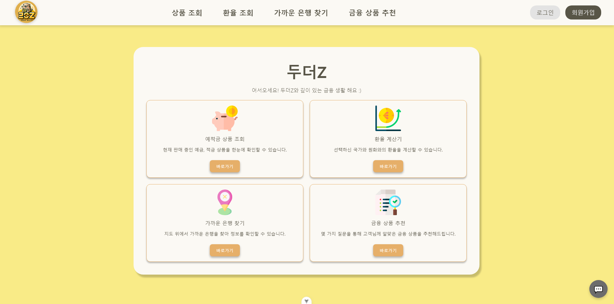
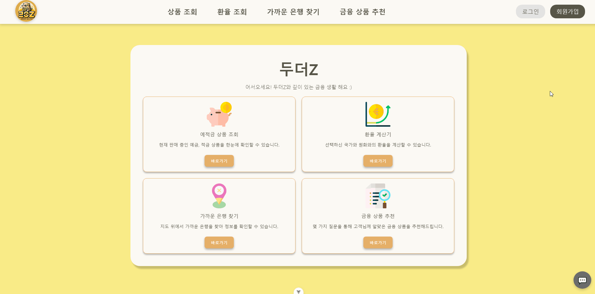
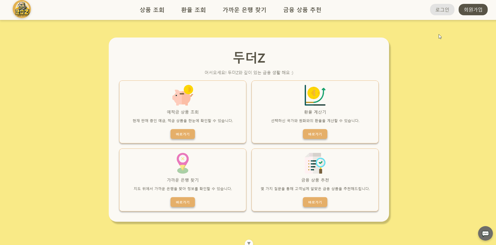
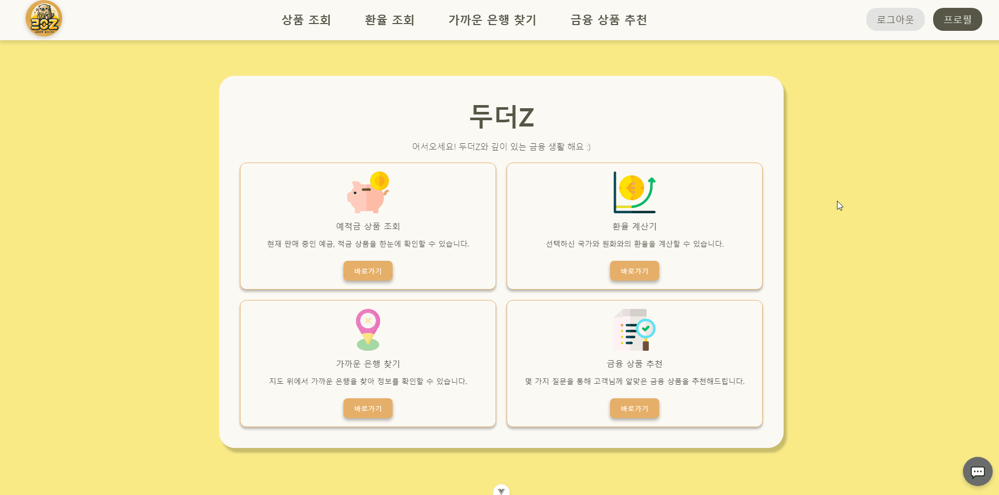

# ✨두더Z Plan (Do The Z Plan) ✨
두더지처럼 깊이 파고 들어 Z세대를 위한 금융 정보를 제공하고 미래 계획을 도와주는 애플리케이션

### ⚙️ **Frontend Team Members**

| **Team FE**  | 신예주  | 이아영  | 이연규👑 |
|:-------------:|:-------:|:-------:|:-------:|
| **Profile**   |  | |  |
| **GitHub ID** | [@yejushin2000](https://github.com/yejushin2000) |[@aaaange](https://github.com/aaaange) | [@Da-413](https://github.com/Da-413) |
| **Role**      |     인근 은행 조회(MAP), 프로필, 설문조사, 금융 상품 추천    | 회원가입, 로그인, 로그아웃, 회원탈퇴, 금융 상품 리뷰, 환율 계산기 | 메인페이지, 금융 상품 조회 및 상세 조회    |

---

### ⚙️ **Backend Team Members**

| **Team FE**  | 신예주  | 이아영  | 이연규👑 |
|:-------------:|:-------:|:-------:|:-------:|
| **Profile**   |  | |  |
| **GitHub ID** | [@yejushin2000](https://github.com/yejushin2000) |[@aaaange](https://github.com/aaaange) | [@Da-413](https://github.com/Da-413) |
| **Role**      |     MAP API를 통한 인근 은행 DB, 상품 리뷰 기능, 환율 API DB    | 회원가입, 로그인, 로그아웃, 회원탈퇴, 예적금 API DB  | 메인페이지, 회원 프로필, 회원별 가입 금융 상품 및 금리 그래프, 설문조사 기능 및 DB, 군집화 비지도 학습 추천 시스템, 생성형 AI 챗봇 서비스 구현 |

---

### 💻 Feature
| 기능                         | 세부 설명                                                                                                                                  |
|------------------------------|-------------------------------------------------------------------------------------------------------------------------------------------|
| **메인 페이지**               | - 인증 유무에 따라 회원가입, 로그인, 로그아웃, 프로필 페이지로 구분 - 예적금 데이터, 환율 계산기, 지도에서 은행 찾기, 금융 상품 추천 기능으로의 네비게이션 제공 |
| **회원가입**                  | - 사용자 이름, 이메일, 비밀번호, 비밀번호 확인 필드 포함 - 이메일 중복 체크 및 비밀번호 조건(특수문자, 숫자 포함) 검증 - 회원가입 후 자동 로그인 처리 |
| **로그인**                    | - 사용자 이메일과 비밀번호를 입력하여 로그인 - 로그인 실패 시 오류 메시지 출력 (예: "이메일 또는 비밀번호가 잘못되었습니다.") - 로그인 후 메인 페이지로 리디렉션 |
| **로그아웃**                  | - 사용자 로그아웃 시 세션 종료 및 로그인 페이지로 리디렉션                                                                          |
| **회원탈퇴**                  | - 사용자가 요청하면 계정을 삭제하는 기능 - 계정 삭제 후 모든 관련 데이터 삭제 및 확인 메시지 출력                                      |
| **회원 프로필 관리**          | - 사용자 기본 정보(이름, 이메일, 가입일 등)를 프로필 페이지에서 조회 - 프로필 수정 가능 (이메일, 비밀번호 변경)                    |
| **회원별 가입 금융상품 조회**| - 사용자가 가입한 금융상품 목록을 조회 - 금융상품의 이름, 금리, 만기일, 가입일 등 정보 제공                                         |
| **회원별 금리 그래프 조회**   | - 가입한 금융상품의 금리 변동을 시각적으로 나타내는 그래프 제공 - 차트 라이브러리 활용 (예: Chart.js)                              |
| **회원 본인이 남긴 댓글 수 확인** | - 사용자가 남긴 모든 댓글의 수를 조회 - 댓글 작성한 상품 및 작성 시간과 함께 출력                                                  |
| **예적금 데이터 저장**        | - 금융상품통합비교공시 API에서 정기예금과 적금 상품 정보를 가져와 DB에 저장 - 데이터 필터링을 통해 필요한 항목만 저장 (예: 금리, 은행명, 상품 종류) |
| **예적금 전체 조회**          | - 사용자에게 다양한 금융상품을 필터링할 수 있는 목록 제공 - 은행 이름, 상품 종류(정기예금/적금) 등을 기준으로 필터링 가능             |
| **예적금 상세 조회**          | - 각 금융상품의 세부 정보(금리, 상품 설명, 조건 등)를 자세히 출력 - [가입하기] 버튼을 눌러 해당 상품을 가입한 상품 목록에 추가         |
| **예적금 리뷰(댓글) 작성**    | - 예적금 상품 상세 페이지에서 리뷰 작성 가능 - 사용자 리뷰 내용, 평점(별점), 작성일 등을 입력할 수 있는 폼 제공                       |
| **리뷰 조회**                 | - 사용자가 작성한 리뷰 목록 조회 - 상품별로 리뷰를 정렬하여 확인 가능 (예: 최신순, 평점순)                                          |
| **리뷰 업데이트**             | - 작성한 리뷰를 수정할 수 있는 기능 제공 - 수정 시 수정된 리뷰 내용과 수정일자를 함께 표시                                          |
| **리뷰 삭제**                 | - 리뷰 작성자만 삭제 가능 - 리뷰 삭제 시 해당 리뷰가 DB에서 제거되고, 삭제된 사실을 사용자에게 알림                               |
| **환율 데이터 요청**          | - 프론트엔드에서 화면 로딩 시 백엔드로 환율 데이터 요청 - 백엔드에서는 환율 API를 호출하여 환율 데이터를 가져오고, 이를 프론트로 반환 |
| **환율 계산기**               | - 사용자 입력 금액을 기준으로 다른 통화로 환산하여 출력 - 계산된 환율과 함께 변환된 금액을 화면에 표시                             |
| **환율 데이터 갱신**          | - 환율 API를 실시간으로 요청하는 것보다, 일정 주기마다 갱신하도록 처리 - 캐시를 사용하여 데이터를 주기적으로 업데이트                |
| **환율 계산기 화면**          | - 사용자가 쉽게 금액을 입력하고 환율을 확인할 수 있는 직관적인 UI 제공 - 입력창, 환율 변환 버튼, 환율 결과 등을 명확하게 표시          |
| **환율 예측**                 | - 환율의 시계열 데이터를 분석하여 향후 환율 변동을 예측 - 예측 알고리즘에 따라 예측된 환율을 사용자에게 제공                         |
| **근처 은행 검색**            | - 카카오맵 API를 사용하여 사용자의 현재 위치를 기반으로 근처 은행을 검색 - 은행 이름, 주소, 연락처 등을 표시                        |
| **설문조사 항목 및 UI/UX**    | - 설문조사의 질문 항목을 정의하고, 사용자에게 직관적인 UI 제공 - 사용자 경험을 고려한 설문 디자인과 흐름 구축                        |
| **설문조사 데이터 저장**      | - 사용자가 설문에 응답한 데이터를 DB에 저장 - 추천 받은 항목과 사용자가 실제로 선택한 상품을 기록하고, 결측치를 처리                |
| **설문조사 응답 기반 필터링** | - 설문조사 응답에 따라 적합한 금융상품을 추천 - 설문 결과에 기반한 필터링 알고리즘을 구현하여 추천 리스트 제공                       |
| **군집화 비지도학습 구현**    | - 설문조사 결과를 기반으로 사용자를 군집화하여, 유사한 고객 그룹을 분석 - 비지도학습 알고리즘을 사용해 군집화 모델 학습 및 테스트     |

---
### 🛠기술 스택 (Technologies Used)

### 🎈Used Tool

---

### 🔑 ERD

---

### 📆 Calendar
| 일시 | 내용 |
|:-------------:|:-------:|
| 2024-11-18  | 기획, 구현 기능 및 일정 정리, 사용자 요구사항 명세서, 역할 분배, 프론트 초안 작성 |
| 2024-11-19 | 프론트 UI/UX 구성, ERD, 메인 페이지, USER(회원가입, 로그인, 로그아웃) 기능 구현, 인근 은행 서치 기능 구현 1차, 피그마로 초안(프로필 페이지, 추천 알고리즘) 완성 |
| 2024-11-20 |  USER(회원가입, 로그인) UI 및 연동, 프로필 기능 구현, 설문조사 모델 구현, 프로필 페이지 UI |
| 2024-11-21 | 예적금 API DB, 예적금 전체 및 상세 조회 UI, 프로필 페이지 UI 및 기능 연동, MAP 수정  |
| 2024-11-22 | 상품 리뷰 UI, 회원 탈퇴 UI, 로그아웃 및 회원 탈퇴 기능 연동, 인증 토큰 수정, 예적금 전체 및 상세 조회 기능 연동, 설문조사 UI, |
|2024-11-23 | 환율 계산기 UI, 회원별 가입 상품 UI 및 기능 구현, 상품 추천 페이지 UI |
|2024-11-24 | 군집화 알고리즘, 필터링 추천 알고리즘 구현, 환율 예측 DB, 상품 리뷰 연동 |
|2024-11-25| 설문조사 DB 연동, 환율 계산기 DB 연동, 사용자 가입 상품 상세페이지 연동, 사용자 별 리뷰 수 업데이트, 지도 UI 업데이트, 필터링 알고리즘 연동, 전반적 CSS 디테일 수정 |
|2024-11-26| 군집화 알고리즘 연동, 리뷰 UI 업데이트, 환율 그래프 UI 업데이트, 프로필 금리 그래프 UI 업데이트, 전반적 CSS 통일, 회원정보 수정 UI, 생성형 AI 챗봇 서비스 구현, 프로젝트 발표 준비 |

--- 

### 💡 Ground Rule
- 매일 오후 6시엔 무조건 오늘 한 것 푸쉬하기 (RP하기)
- 각자 RP 한 것 스스로가 merge하지 않기 
    - 팀 메신저에 RP 했음을 알리기
    - 본인을 제외한 팀원이 해당 사항 확인하고 merge 하기

---

---
### 스크린샷 (Screenshots)
1. **메인페이지**:
    

2. **회원가입 화면**: 사용자가 아이디와 비밀번호를 입력하여 계정을 생성합니다.
   

3. **로그인 화면**: 사용자가 아이디와 비밀번호를 입력하여 로그인합니다.
   

4. **상품 조회**: 사용자가 아이디와 비밀번호를 입력하여 로그인합니다.
   

2. **로그인 화면**: 사용자가 아이디와 비밀번호를 입력하여 로그인합니다.
   

2. **로그인 화면**: 사용자가 아이디와 비밀번호를 입력하여 로그인합니다.
   

2. **로그인 화면**: 사용자가 아이디와 비밀번호를 입력하여 로그인합니다.
   

2. **로그인 화면**: 사용자가 아이디와 비밀번호를 입력하여 로그인합니다.
   

2. **대시보드 화면**: 로그인 후 사용자는 예적금 상품 목록을 확인할 수 있습니다.
   