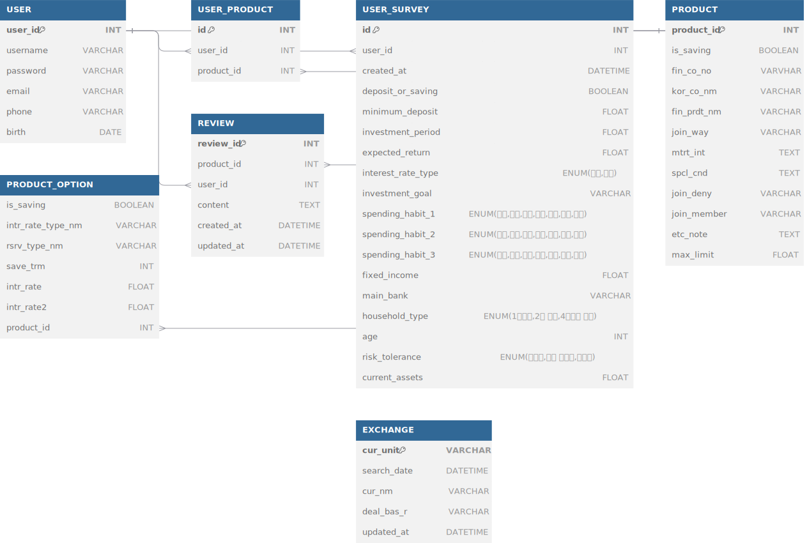

# 두더Z Plan (Do The Z Plan) 
두더지처럼 깊이 파고 들어 Z세대를 위한 금융 정보를 제공하고 미래 계획을 도와주는 애플리케이션

### ⚙️ **Frontend Team Members**

| **Team FE**  | 신예주  | 이아영  | 이연규👑 |
|:-------------:|:-------:|:-------:|:-------:|
| **Profile**   |  | |  |
| **GitHub ID** | [@yejushin2000](https://github.com/yejushin2000) |[@aaaange](https://github.com/aaaange) | [@Da-413](https://github.com/Da-413) |
| **Role**      |     인근 은행 조회(MAP), 프로필, 설문조사, 금융 상품 추천    | 회원가입, 로그인, 금융 상품 리뷰, 환율 계산기 | 메인페이지, 금융 상품 조회 및 상세 조회    |

---

### ⚙️ **Backend Team Members**

| **Team FE**  | 신예주  | 이아영  | 이연규👑 |
|:-------------:|:-------:|:-------:|:-------:|
| **Profile**   |  | |  |
| **GitHub ID** | [@yejushin2000](https://github.com/yejushin2000) |[@aaaange](https://github.com/aaaange) | [@Da-413](https://github.com/Da-413) |
| **Role**      |     MAP API를 통한 인근 은행 DB, 상품 리뷰 기능, 환율 API DB    | 회원가입, 로그인, 로그아웃, 회원탈퇴, 예적금 API DB  | 회원 프로필, 회원별 가입 금융 상품 및 금리 그래프, 설문조사 기능 및 DB |

---

### 💻 Feature

---

### 🔑 ERD

---

### 📆 Calendar
| 일시 | 내용 |
|:-------------:|:-------:|
| 2024-11-18  | 기획, 구현 기능 및 일정 정리, 사용자 요구사항 명세서, 역할 분배, 프론트 초안 작성 |
| 2024-11-19 | 프론트 UI/UX 구성, ERD, 메인 페이지, USER(회원가입, 로그인, 로그아웃) 기능 구현, 인근 은행 서치 기능 구현 1차, 피그마로 초안(프로필 페이지, 추천 알고리즘) 완성 |
| 2024-11-20 |  USER(회원가입, 로그인) UI 및 연동, 프로필 기능 구현, 설문조사 모델 구현, 프로필 페이지 UI |
| 2024-11-21 | 예적금 API DB, 예적금 전체 및 상세 조회 UI, 프로필 페이지 UI 및 기능 연동, MAP 수정  |
| 2024-11-22 | 상품 리뷰 UI, 회원 탈퇴 UI, 로그아웃 및 회원 탈퇴 기능 연동, 인증 토큰 수정, 예적금 전체 및 상세 조회 기능 연동, 설문조사 UI, |
|2024-11-23 | 환율 계산기 UI, 회원별 가입 상품 UI 및 기능 구현, 상품 추천 페이지 UI |
|2024-11-24 | 군집화 알고리즘, 환율 예측 백엔드 구현, 추천 알고리즘 프론트 구현 및 다른 기능 업데이트 |
|2024-11-25| 전반적인 디테일 수정|
|2024-11-26| 프로젝트 발표 준비 |

--- 

### 💡 Ground Rule
- 매일 오후 6시엔 무조건 오늘 한 것 푸쉬하기 (RP하기)
- 각자 RP 한 것 스스로가 merge하지 않기 
    - 팀 메신저에 RP 했음을 알리기
    - 본인을 제외한 팀원이 해당 사항 확인하고 merge 하기

---